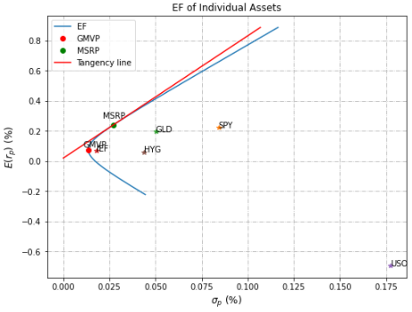

layout: home
author_profile: true

### (TEST) Field of Interest: Portfolio Optimization

The image presents 2-types of optimized portfolios, with minimum variance (GMVP) and maximum sharpe ratio (MSRP). The universe consists of 5 ETFs listed in the US market.
* IEF: 7-10year treasury
